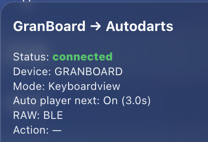
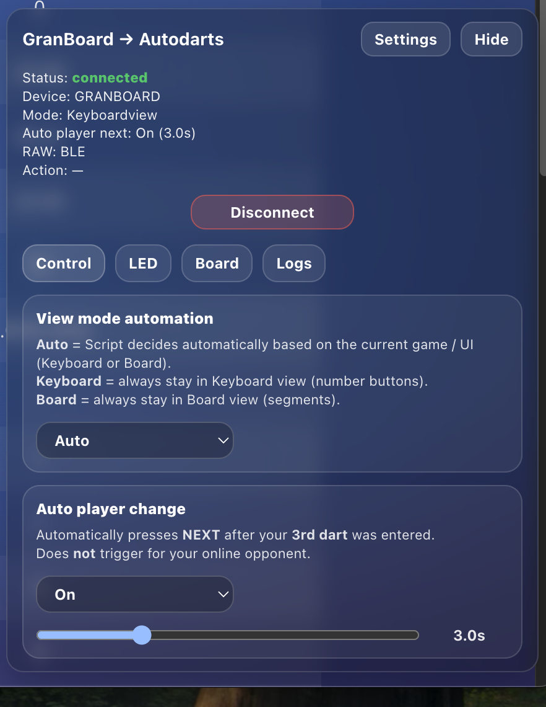
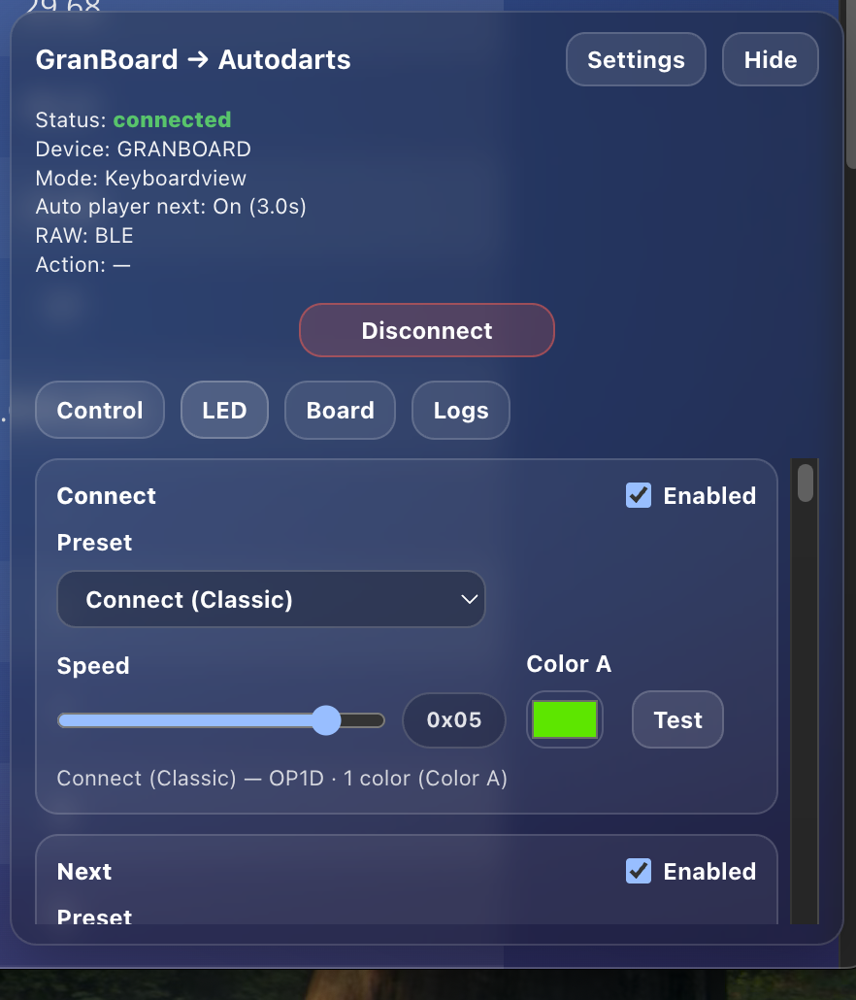
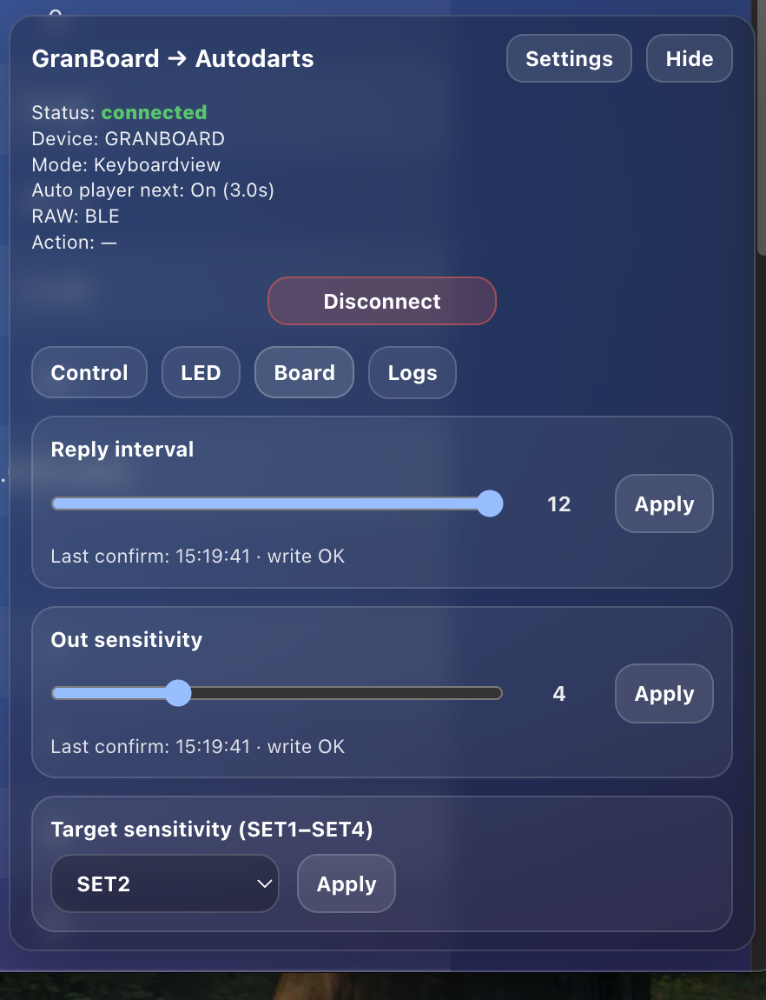

# GranBoard with Autodarts

**GranBoard with Autodarts** is a userscript (Tampermonkey) that connects a **GranBoard via Bluetooth (BLE)** directly to **Autodarts** and automatically enters throws.

The script intelligently detects **how inputs must be entered in Autodarts** and automatically switches between **keyboard input** and **board view**, depending on the current game mode.

---

## 🖥️ Requirements (IMPORTANT)

- ✅ PC or laptop **with Bluetooth**
- ✅ Google Chrome or Microsoft Edge
- ❌ No smartphone / tablet
- ❌ Firefox is not supported (no WebBluetooth)

Additionally required:
- GranBoard (powered on)
- Autodarts account
- Tampermonkey browser extension

---

## 📦 Installation

### 1️⃣ Install Tampermonkey
https://www.tampermonkey.net/

### 2️⃣ Browser & extension settings  
(see screenshots below: “Installation appendix”)

- Enable developer mode
- Allow “Userscripts”
- Website access: **All websites**  
  → (at minimum allow https://play.autodarts.io)

---

### 3️⃣ Install the userscript
👉 Open:
https://raw.githubusercontent.com/Lennart-Jerome/GranBoard-with-Autodarts/main/GranBoard-with-Autodarts.user.js

Tampermonkey will automatically detect the script  
(Tampermonkey must already be installed at this point).

---

### “Installation appendix”  
Otherwise the script will not work:

  

---

## ▶️ First steps

1. Open Autodarts: https://play.autodarts.io  
2. Power on the GranBoard  
3. A **GB button** appears in the bottom right corner  
4. Click → overlay opens  
5. Click **Connect**  
6. Select the GranBoard in the Bluetooth dialog

---

## 🧠 How does the script work?

### 🔁 AutoView logic (recommended)

For **every throw**, the script checks which input method Autodarts allows:

| Situation | Action |
|---------|--------|
Number keypad available | Input via keyboard
No numbers (e.g. Bobs27) | Automatic switch to board view
Board view active | Direct click on the dartboard

The current mode is shown in the overlay.

---

## ⚙️ Settings

### 🕹 Control

- **Auto** → recommended
- Keyboard → always use keypad
- Board → always use board view

---

### 🌈 LED

- LED reactions per event
- Presets, colors & speed
- Test button for each effect

---

### 🎯 Board

- Reply interval
- Out sensitivity
- Target sets (SET1–SET4)

---

### 🪵 Logs
- Off / Basic / Advanced
- RAW BLE data visible

---

## 🔐 Privacy & Security

- ✔️ No accounts or tokens
- ✔️ No fixed MAC addresses
- ✔️ All data stays local in the browser
- ✔️ BLE UUIDs are GranBoard standard

---

## 🚧 Known limitations

- Bluetooth dialog must always be confirmed manually
- Autodarts UI changes may require adjustments

---

## 🚀 Roadmap

- Auto-Next (optional)
- Additional LED events
- More detailed board feedback

---

## 📜 License

Private use & hobby projects allowed.  
No official connection to Autodarts or GranBoard.
