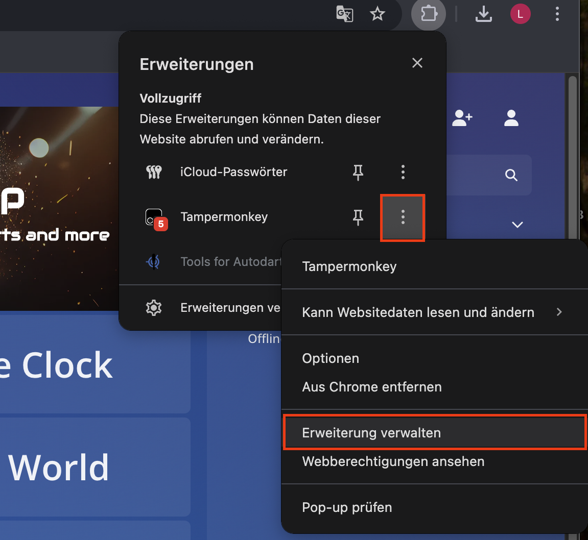
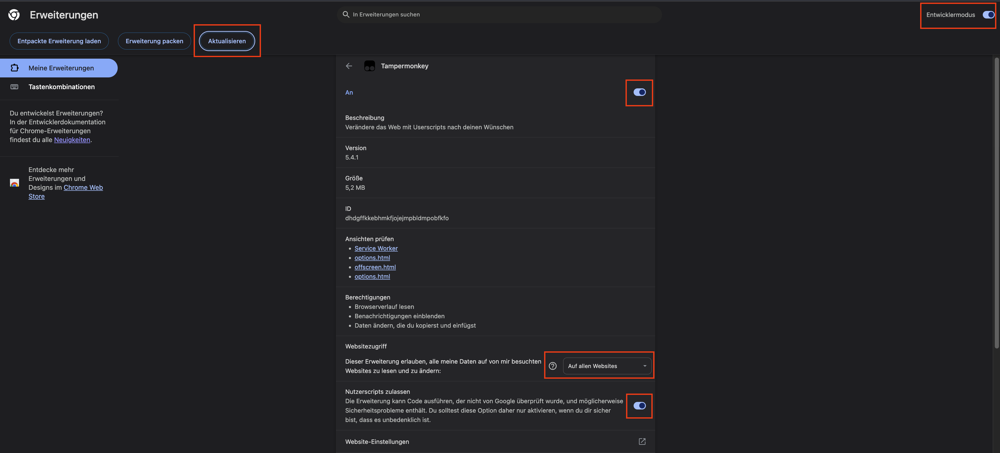

# GranBoard for Autodarts

**GranBoard for Autodarts** ist ein Userscript (Tampermonkey), das ein **GranBoard per Bluetooth (BLE)** direkt mit **Autodarts** verbindet und Würfe automatisch einträgt.

Das Script entscheidet dabei **intelligent**, ob Eingaben über das **Autodarts-Keyboard** oder direkt über die **Scheibenansicht (Boardview)** erfolgen müssen – abhängig vom aktuellen Spielmodus.

---

## ✨ Features

- 🔵 Bluetooth-Verbindung direkt zum GranBoard (WebBluetooth)
- 🎯 Automatische Erkennung von Treffern (Single / Double / Triple / Bull / Miss)
- ⌨️ **Keyboard-Eingabe**, wenn Zahlen im Autodarts-Keypad erlaubt sind
- 🎯 **Boardview-Fallback**, wenn keine Zahlen erlaubt sind (z. B. Bobs27)
- 🔁 Automatisches Umschalten zwischen Keyboard- und Boardview (Auto-Modus)
- 👁️ Overlay mit Status, Modus-Anzeige und Debug-Logs
- 🌈 **Visuelles Feedback am Board**, wenn `Next` gedrückt wurde (Touchfeld leuchtet kurz)

---

## 🧩 Unterstützte Spielmodi (Beispiele)

- ✅ X01
- ✅ Cricket
- ✅ Training
- ✅ Bobs27  
  → Hier gibt es **kein Zahlen-Keyboard**, nur *Hit / Miss / Undo / Next*  
  → Das Script wechselt automatisch in die **Boardview** und klickt die Scheibe ❗ Manuelles umschalten in der autodarts UI aktuell noch notwendig

---

## ⚠️ Aktueller Entwicklungsstand (Wichtig)

- ❗ **Kein Auto-Next**  
  → `Next` muss aktuell **manuell über das Touchfeld am GranBoard** gedrückt werden  
  → Automatisches Next ist **geplant**, aber noch nicht implementiert
- ❗ **LED-Steuerung ist noch in Entwicklung**  
  → Möglicherweise muss das Board disconnected und reconnected werden um den initalen Regenbogen Effekt zu stoppen
  → Aktuell gibt es **nur ein visuelles Feedback**, wenn `Next` gedrückt wurde  
  → Das Touchfeld leuchtet kurz im Regenbogen-Modus  
  → Weitere LED-Integrationen sind geplant (DevTools sind vorbereitet)

---

## 🖥️ Voraussetzungen

- Google **Chrome** oder **Microsoft Edge**
- Bluetooth aktiviert
- GranBoard eingeschaltet
- Autodarts Account
- **Tampermonkey** Browser-Erweiterung

> ❌ Firefox wird aktuell **nicht unterstützt**, da WebBluetooth dort nicht zuverlässig verfügbar ist.

---

## 🔧 Browser-Einstellungen (Sehr wichtig!)

Damit das Script funktioniert, müssen **Userscripts erlaubt sein**:

### Chrome / Edge
1. Tampermonkey installieren
2. In Tampermonkey optionen:
   - „Userscripts ausführen“ aktivieren ❗ 
3. Bluetooth-Zugriff im Browser erlauben
4. Pop-up zum Bluetooth-Gerät **nicht blockieren**

> ⚠️ Der Bluetooth-Dialog muss **immer manuell bestätigt** werden  
> (Browser-Sicherheitsvorgabe)

---

## 📦 Installation

### 1️⃣ Tampermonkey installieren
- https://www.tampermonkey.net/

Einstellung von Tampermonkey erweiterung

---

### 2️⃣ Userscript installieren
👉 Öffne diesen Link (Tampermonkey erkennt das automatisch):
https://raw.githubusercontent.com/Lennart-Jerome/GranBoard-with-Autodarts/main/GranBoard-with-Autodarts.user.js

### 3️⃣ Autodarts öffnen
- https://play.autodarts.io

### 4️⃣ GranBoard einschalten

### 5️⃣ Overlay öffnen
- Unten rechts erscheint ein **GB-Kreis**
- Klicken → Overlay öffnet sich

### 6️⃣ Verbinden
- Auf **Connect** klicken
- GranBoard im Bluetooth-Dialog auswählen
- Verbindung bestätigen

---

## 🔄 Wie funktioniert die Eingabe-Logik?

### 🔹 Keyboard hat Vorrang
Wenn im Autodarts-Keypad **Zahlen sichtbar und klickbar sind** (z. B. `S20`, `D20`, `T20`):
- Treffer werden **über das Keyboard eingetragen**
- Alle anderen Treffer gelten als **Miss**

### 🔹 Boardview-Fallback (Auto)
Wenn das Keyboard **keine Zahlen enthält**, z. B.:
- nur `Hit`
- `Miss`
- `Undo`
- `Next`

➡️ Dann:
- wechselt das Script automatisch in die **Boardview**
- klickt die Scheibe direkt an der berechneten Position

Der aktuelle Modus wird im Overlay angezeigt:

---

## 🔘 Overlay & Bedienung

- **Connect / Disconnect**: Bluetooth-Verbindung
- **Mode-Auswahl**:
  - Auto (empfohlen)
  - Keyboard
  - Board
- **Debug-Modus**:
  - Zeigt Logs & RAW-Daten
- **Status-Anzeige**:
  - Grün = verbunden
  - Rot = getrennt

---

## 🔐 Datenschutz & Sicherheit

- ✅ Keine personenbezogenen Daten
- ✅ Keine Accounts, Tokens oder IDs
- ✅ Keine festen MAC-Adressen
- ✅ BLE-UUIDs sind bei allen GranBoards identisch
- ✅ Alle Daten bleiben lokal im Browser

---

## 🧪 Kompatibilität

- Getestet mit GranBoard 132 (BLE)
- Sollte mit allen GranBoard-Modellen funktionieren,
  die von der offiziellen GranBoard-App unterstützt werden

---

## 🚧 Bekannte Einschränkungen

- Autodarts UI-Änderungen können Anpassungen nötig machen
- WebBluetooth ist browserabhängig
- Firefox wird nicht unterstützt

---

## 🛠️ Entwicklung & Roadmap

Geplante Features:
- Automatisches `Next`
- Erweiterte LED-Steuerung
- Feineres visuelles Feedback
- Optionale Browser-Erweiterung

Beiträge, Feedback und Tests sind willkommen 👍

---

## 📜 Lizenz

Private Nutzung & Hobby-Projekte erlaubt.  
Keine offizielle Verbindung zu Autodarts oder GranBoard.

