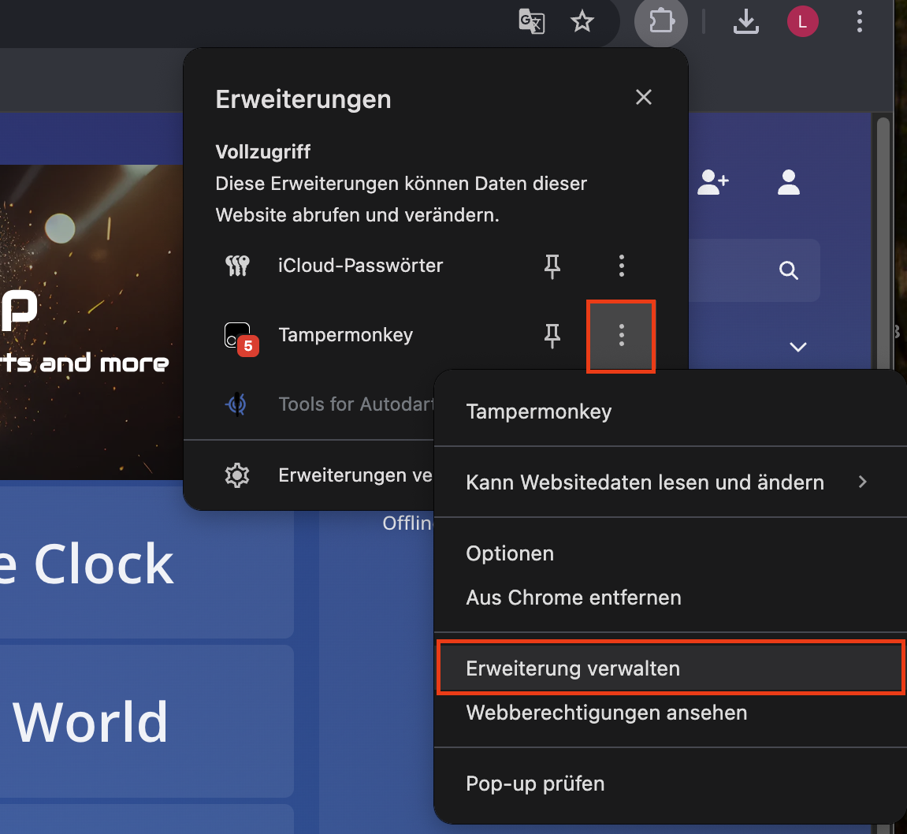
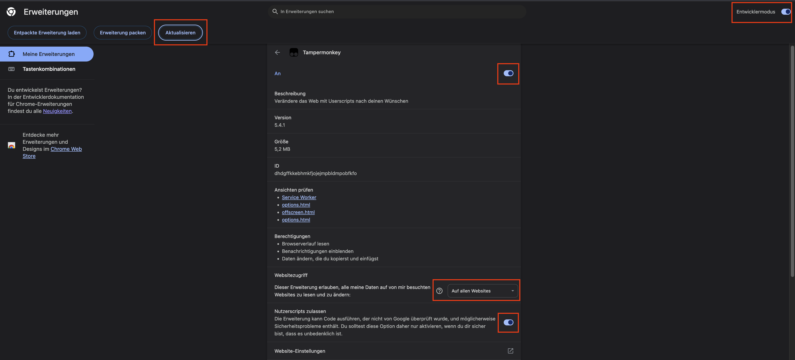
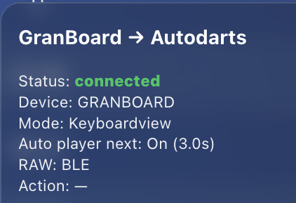
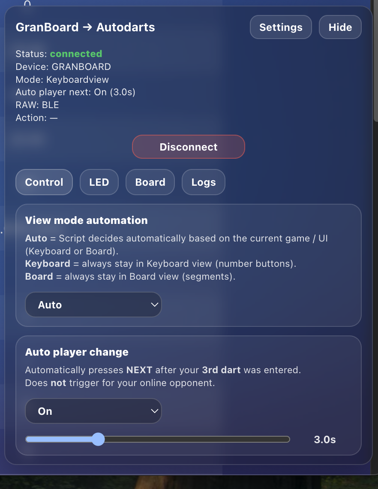
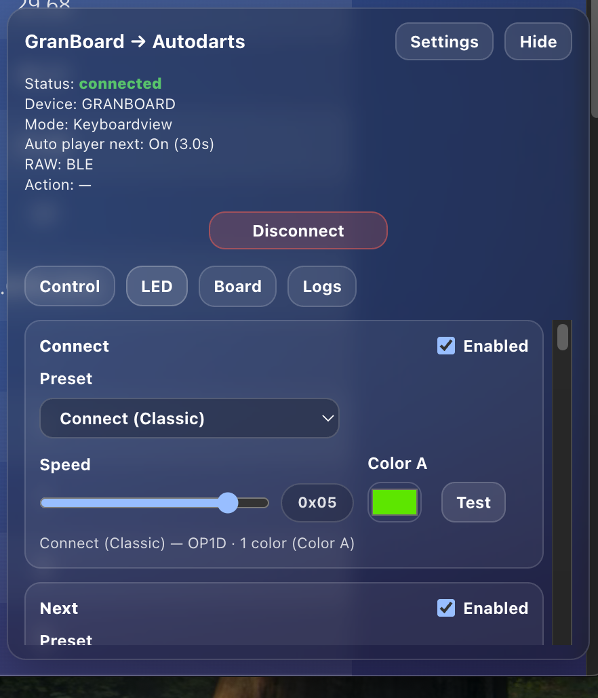
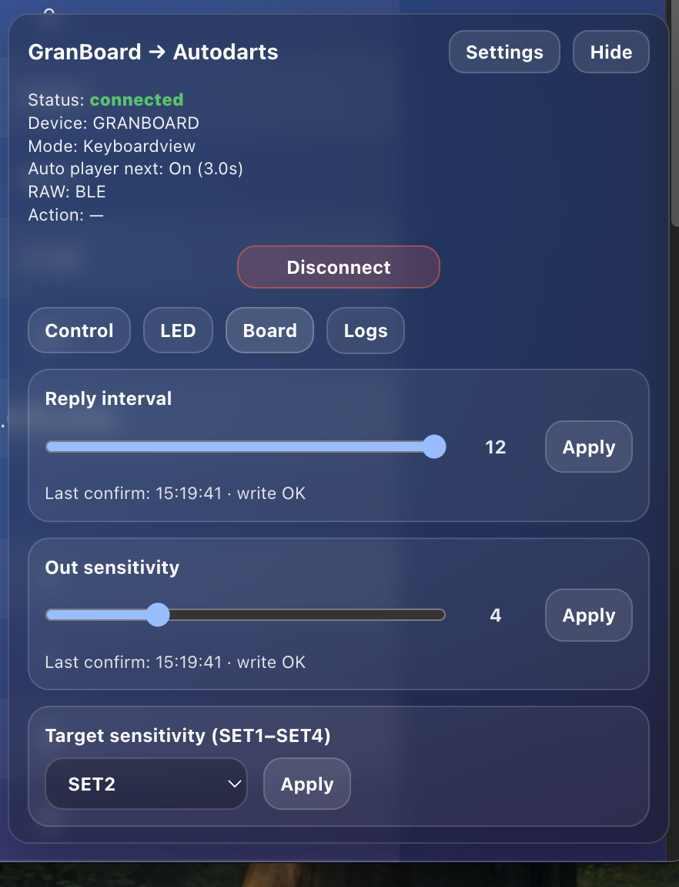

# GranBoard with Autodarts

**GranBoard with Autodarts** ist ein Userscript (Tampermonkey), das ein **GranBoard per Bluetooth (BLE)** direkt mit **Autodarts** verbindet und Würfe automatisch einträgt.

Das Script erkennt intelligent, **wie Eingaben in Autodarts erfolgen müssen**, und schaltet automatisch zwischen **Keyboard-Eingabe** und **Boardview** um – abhängig vom aktuellen Spielmodus.

---

## 🖥️ Voraussetzungen (WICHTIG)

- ✅ PC, Laptop oder Android Device **mit Bluetooth**
- ✅ Google Chrome oder Microsoft Edge
- ❌ Kein Iphone (IOS) oder Ipad (IpadOS)
- ❌ Firefox wird nicht unterstützt (kein WebBluetooth)

Zusätzlich benötigt:
- GranBoard (eingeschaltet)
- Autodarts Account
- Tampermonkey Browser-Erweiterung

---

## 📦 Installation 

### 1️⃣ Tampermonkey installieren
in dem Browser Store "Tampermonkey" suchen und hinzufügen

Direkt Link (rechts klick in neuem tab öffen):

Chrome: https://chromewebstore.google.com/detail/dhdgffkkebhmkfjojejmpbldmpobfkfo?utm_source=item-share-cb

Edge:   https://microsoftedge.microsoft.com/addons/detail/tampermonkey/iikmkjmpaadaobahmlepeloendndfphd

oder auf die Webseite und dem Download link für den jeweiligen Browser folgen
https://www.tampermonkey.net/

### 2️⃣ Browser- & Erweiterungs-Einstellungen 
Einstellungen werden benötigt
siehe unten Beispiel Screenshot "Anhang Installation"

- Entwicklermodus aktivieren
- „Userscripts zulassen“
- Webseitenzugriff: **Auf allen Websites** -> (mindestens freigeben https://play.autodarts.io)

---

### 3️⃣ Userscript installieren
👉 Öffne:
https://raw.githubusercontent.com/Lennart-Jerome/GranBoard-with-Autodarts/main/GranBoard-with-Autodarts.user.js

Tampermonkey erkennt das Script automatisch. (tampermonkey muss zu diesem Zeitpunkt installiert sein)

### "Anhang Installation" 
sonst funktioniert das Script nicht:

---

## ▶️ Erste Schritte

1. Autodarts öffnen: https://play.autodarts.io
2. GranBoard einschalten
3. Unten rechts erscheint ein **GB-Button**
4. Klick → Overlay öffnet sich
5. **Connect** klicken
6. GranBoard im Bluetooth-Dialog auswählen

---

## 🧠 Wie funktioniert das Script?

### 🔁 AutoView-Logik (empfohlen)

Das Script prüft **bei jedem Wurf**, welche Eingabeform Autodarts erlaubt:

| Situation | Aktion |
|---------|--------|
Zahlen-Keyboard vorhanden | Eingabe über Keyboard
Keine Zahlen (z. B. Bobs27) | Automatischer Wechsel zur Boardview
Boardview aktiv | Direkter Klick auf die Scheibe

Der aktuelle Modus wird im Overlay angezeigt.

---

## ⚙️ Einstellungen

### 🕹 Control

- **Auto** → empfohlen
- Keyboard → immer Zahlenfeld
- Board → immer Scheibenansicht

---

### 🌈 LED

- LED-Reaktionen pro Ereignis
- Presets, Farben & Geschwindigkeit
- Test-Button pro Effekt

---

### 🎯 Board

- Antwortintervall
- Out-Sensitivität
- Target-Sets (SET1–SET4)

---

### 🪵 Logs
- Off / Basic / Advanced
- RAW BLE-Daten sichtbar

---

## 🔐 Datenschutz & Sicherheit

- ✔️ Keine Accounts oder Tokens
- ✔️ Keine festen MAC-Adressen
- ✔️ Alle Daten bleiben lokal im Browser
- ✔️ BLE-UUIDs sind GranBoard-Standard

---

## 🚧 Bekannte Einschränkungen

- Bluetooth-Dialog muss immer bestätigt werden
- Autodarts UI-Änderungen können Anpassungen erfordern

---

## 🚀 Roadmap

- Weitere LED-Events

---

## 🎯 Autodarts

Wenn du Lust hast zu spielen oder das Script gemeinsam zu testen, kannst du mich gerne auf Autodarts adden:
lenny_

---

## 💸 Unterstützung

Wenn dir dieses Projekt gefällt und du mich in der Weiterentwicklung unterstützen möchtest:
https://paypal.me/LennartJerome

---

## 📜 Lizenz

Private Nutzung & Hobby-Projekte erlaubt.  
Keine offizielle Verbindung zu Autodarts oder GranBoard.
